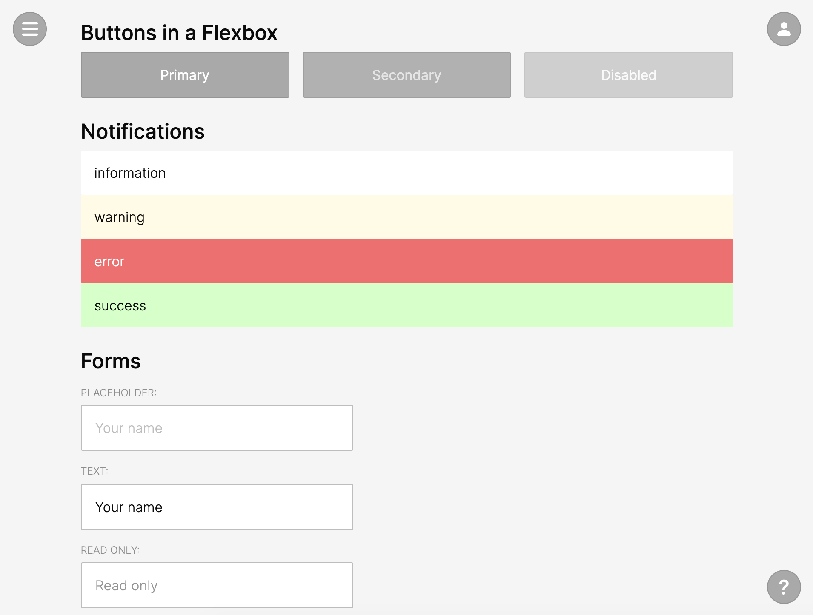
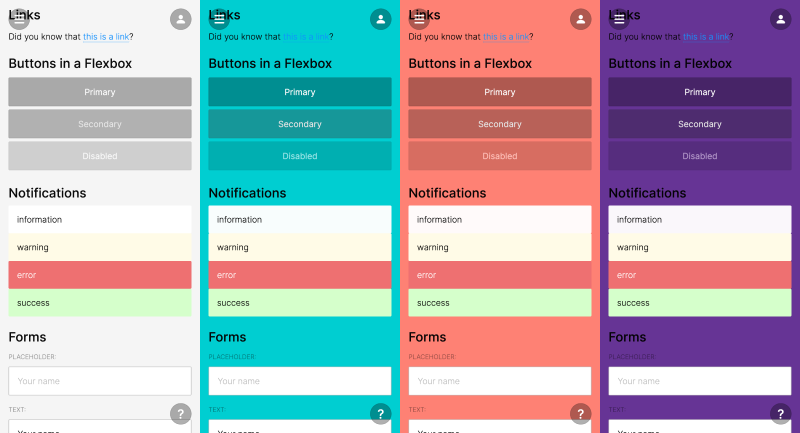

# Arcade CSS framework

**Fun, Beautiful, Interactive CSS system for Games**

Demo: https://tomsoderlund.github.io/arcade-css/

## Design goals

- A **good starting point** for any web/mobile/PWA project.
- **Plug-and-play.** Just drop the CSS file into your HTML page. Avoid weird classes* as much as possible, just use element names.
- **Easy to customize** (“themeable”). Examples:
  - Elements use opacity so you can customize the background color (click “Change background” in the [demo page](https://tomsoderlund.github.io/arcade-css/)).
  - Change the color of button, and hover states are automatically updated (they use `opacity`/`filter`).
- Use the [**Three Zone Navigation System**](https://medium.com/@tomsoderlund/three-zone-navigation-system-45f20d08bed4).
- **Clear interaction states** for buttons etc.
- Lightweight (somewhat).
- Compatible (somewhat).

*Exceptions: `.fieldset` (because of `fieldset` flexbox bug), `.tag` (tags/tokens), `.flex` (flexbox container for columns etc).

Changing color theme just by changing `background-color` of `body`:

## Todo

- [ ] Progress button
- [ ] Tags - revise
- [ ] Code block and Block quote
- [ ] Toggle switch
- [ ] Range Slider 2D
- [ ] Hamburger menu

## Install

    yarn add arcade-css

## Import in JavaScript

    import 'arcade-css/dist/arcade.min.css'

And use the [“Fredoka” font](https://rsms.me/inter/):

    <link href="https://fonts.googleapis.com/css2?family=Fredoka:wght@300;400;600&display=swap" rel="stylesheet">

## Update NPM

    yarn publish

(Will run `yarn prepare` automatically, which builds the `/dist` folder)
