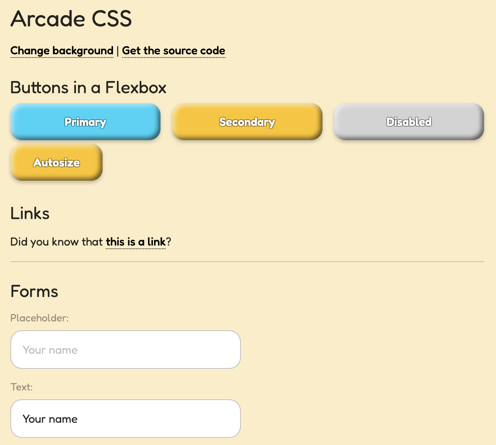

# Arcade CSS

**Fun, Beautiful, Interactive CSS system for Games**

Demo: https://tomsoderlund.github.io/arcade-css/

## Design goals

- A **good starting point** for any game web/mobile/PWA project.
- **Plug-and-play.** Just drop the CSS file into your HTML page. Avoid weird classes* as much as possible, just use element names.
- **Clear interaction states** for buttons etc.
- Lightweight (somewhat).
- Compatible (somewhat).

*Exceptions: `.fieldset` (because of `fieldset` flexbox bug), `.tag` (tags/tokens), `.flex` (flexbox container for columns etc).

Changing color theme just by changing `background-color` of `body`:

## Inspiration

Inspired by [@KartInnka and her Tropical GUI Pack](https://creativemarket.com/K_ArtInnka/6886672-Tropical-GUI-Pack).

## Todo

- [ ] ...

## Install

    yarn add arcade-css

## Import in JavaScript

    import 'arcade-css/dist/arcade.min.css'

And use the “Fredoka” font:

    <link href="https://fonts.googleapis.com/css2?family=Fredoka:wght@400;500;600&display=swap" rel="stylesheet">

## Update NPM

    yarn publish

(Will run `yarn prepare` automatically, which builds the `/dist` folder)
